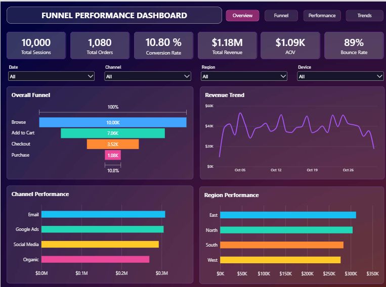
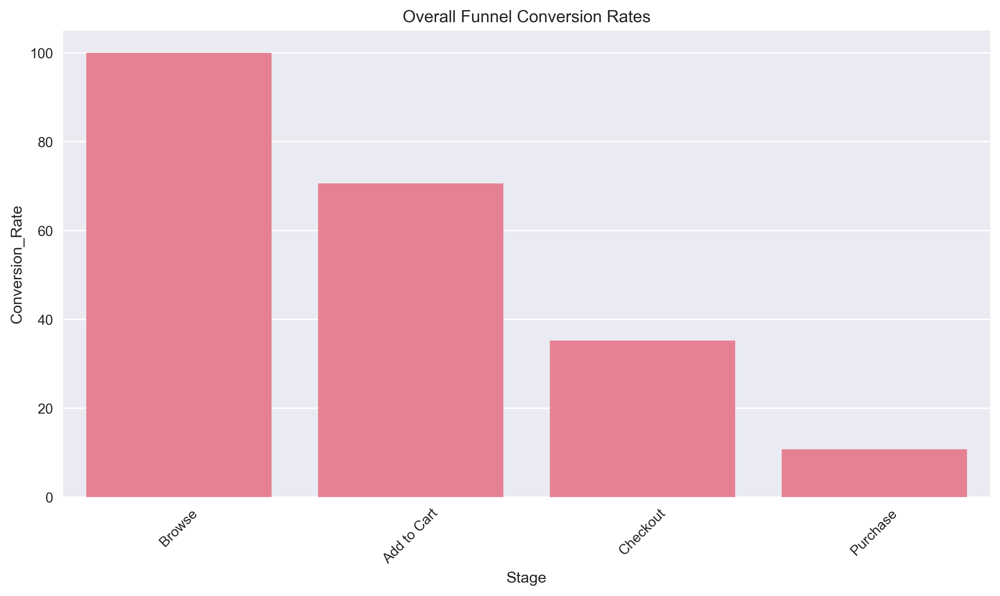
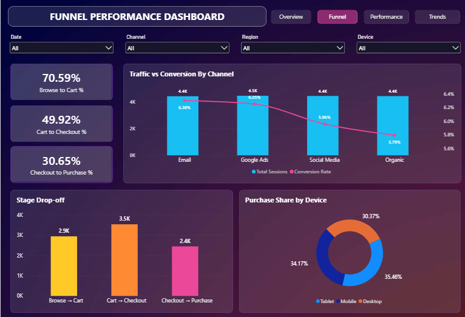
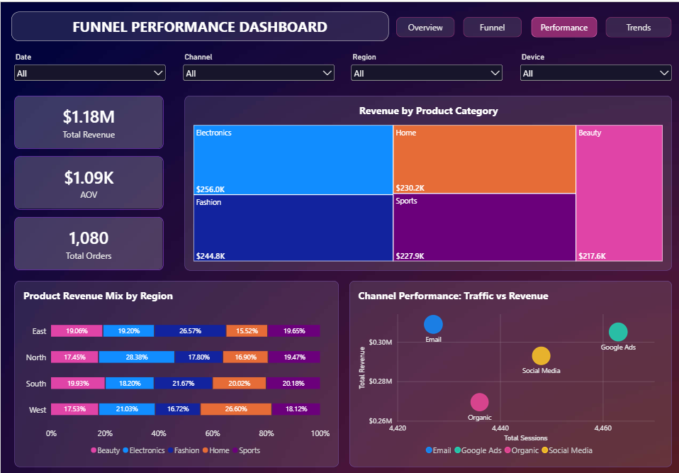
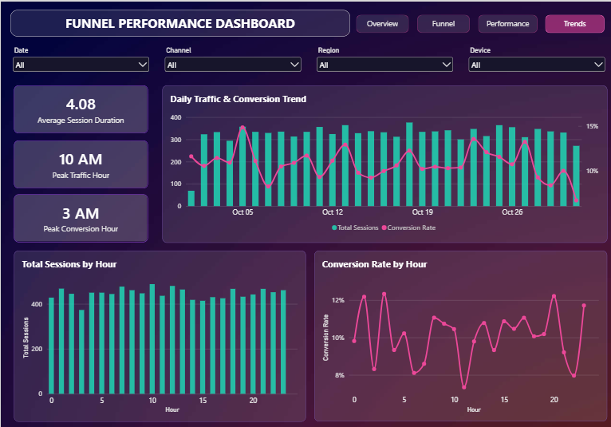

# 🛒 E-Commerce Funnel Performance Analysis

> **End-to-end data analytics project using Python and Power BI to analyze customer journey, conversion drop-offs, revenue performance, and user behavior.**

**Quick Access:** [Python Notebook](funnel_analysis.ipynb) • [Power BI Dashboard](Funnel_analysis_dashboard.pbix) • [Project Report (PDF)](Ecommerce_Funnel_Analysis_Report.pdf) • [Raw Dataset](funnel_analysis_raw_data.csv)

---

## 📊 Dashboard Preview

## 📌 Project Overview

This project analyzes an e-commerce customer journey across the **Browse → Add to Cart → Checkout → Purchase** funnel. Python was used for data preparation, session-level transformation, exploratory analysis, KPI calculation, and behavioral analysis. Power BI was then used to build an interactive four-page dashboard for business reporting and decision-making.

## 🎯 Business Objectives

- Analyze customer progression through the conversion funnel.
- Identify the largest funnel drop-offs and conversion bottlenecks.
- Evaluate performance across channels, regions, devices, and product categories.
- Understand customer engagement through bounce rate and session duration.
- Identify daily and hourly traffic and conversion patterns.
- Translate analytical findings into actionable business recommendations.

## 🛠️ Tools & Technologies

| Area | Tools |
|---|---|
| Data Analysis | Python, Pandas, NumPy |
| Visualization | Matplotlib, Seaborn, Plotly |
| BI & Reporting | Power BI, Power Query, DAX |
| Environment | Jupyter Notebook |

## 📊 Dataset

The event-level dataset contains **21,663 customer interaction records** across **10,000 unique sessions**.

Key fields include `User_ID`, `Session_ID`, `Event`, `Timestamp`, `Device`, `Region`, `Channel`, `Product_Category`, `Revenue`, and `Bounce_Flag`.

## 🔄 Analytical Workflow

**Raw Dataset → Data Preparation → Session-Level Analysis → Exploratory Data Analysis (EDA) → KPI Calculation → Power BI Modeling → Interactive Dashboard → Business Insights**

### Python Analysis

Python was used to inspect data quality, engineer date/time features, sequence events within sessions, aggregate event-level records into session-level data, calculate session duration and maximum funnel stage, and analyze funnel, segment, revenue, engagement, and time-based performance.

### Power BI Development

Power BI was used to create reusable DAX measures, interactive filtering, synchronized slicers, cross-page navigation, and four dedicated analytical dashboard pages.

## 📈 Key Performance Metrics

| Metric | Result |
|---|---:|
| Total Sessions | **10,000** |
| Total Orders | **1,080** |
| Overall Conversion Rate | **10.80%** |
| Total Revenue | **$1,176,405.78** |
| Average Order Value | **$1,089.26** |
| Bounce Rate | **89.20%** |
| Average Session Duration | **4.08 min** |

## 🔻 Funnel Performance

| Funnel Stage | Sessions | Stage Conversion |
|---|---:|---:|
| Browse | 10,000 | 100% |
| Add to Cart | 7,059 | 70.59% |
| Checkout | 3,524 | 49.93% |
| Purchase | 1,080 | 30.65% |

The largest absolute drop occurs between **Add to Cart and Checkout**, where **3,535 sessions** are lost. The weakest stage conversion is **Checkout → Purchase at 30.65%**.

### Python Funnel Visualization

## 💡 Key Business Insights

- Only **10.80%** of the 10,000 sessions progress to purchase.
- **Cart → Checkout** has the largest absolute loss, with **3,535 sessions** dropping out.
- **Checkout → Purchase** is the biggest conversion-efficiency bottleneck at **30.65%**.
- Session-level bounce rate is **89.20%**, highlighting an important engagement area to investigate.
- Overall average session duration is **4.08 minutes**, while purchasing sessions average approximately **10.55 minutes**.
- Peak traffic occurs at **10 AM**, while the highest hourly conversion rate occurs at **3 AM**, showing that traffic volume and conversion efficiency do not peak together.

## 📊 Power BI Dashboard

The interactive Power BI report contains four pages, each designed around a distinct business question:

| Page | Business Question | Focus |
|---|---|---|
| **Overview** | What happened? | Sessions, orders, conversion, revenue, AOV, bounce rate and overall funnel performance |
| **Funnel Analysis** | Where are users being lost? | Stage conversion, drop-offs, channel conversion and device purchase behavior |
| **Performance Analysis** | What drives business performance? | Revenue and orders across categories, regions and channels |
| **Trends & User Behavior** | When and how are users behaving? | Daily/hourly traffic, conversion patterns, session duration and peak periods |

**Interactive features:** synchronized Date, Channel, Region & Device filters • cross-page navigation • dynamic DAX measures.

### Funnel Analysis

### Performance Analysis

### Trends & User Behavior

## 🚀 Business Recommendations

1. **Optimize the checkout experience** — investigate unnecessary steps, payment failures, delivery charges, and form complexity to improve Checkout → Purchase conversion.
2. **Reduce cart abandonment** — test clearer pricing, stronger checkout CTAs, and cart-recovery strategies to recover high-intent users.
3. **Investigate high bounce behavior** — analyze landing-page relevance, traffic quality, and user experience to understand early disengagement.
4. **Optimize marketing beyond traffic volume** — evaluate conversion efficiency alongside traffic volume when scheduling and assessing campaigns.
5. **Prioritize high-performing segments** — use channel, region, device, and product-category performance to guide targeting, merchandising, and resource allocation.

## 📁 Repository Contents

| File | Description |
|---|---|
| [`funnel_analysis_raw_data.csv`](funnel_analysis_raw_data.csv) | Raw event-level e-commerce dataset |
| [`funnel_analysis.ipynb`](funnel_analysis.ipynb) | Complete Python analysis and visualizations |
| [`Funnel_analysis_dashboard.pbix`](Funnel_analysis_dashboard.pbix) | Interactive Power BI dashboard |
| [`Ecommerce_Funnel_Analysis_Report.pdf`](Ecommerce_Funnel_Analysis_Report.pdf) | Portfolio-ready project report |
| [`requirements.txt`](requirements.txt) | Python dependencies used in the analysis |

Dashboard screenshots and analysis visualizations are also included in the repository for quick portfolio viewing.

## ▶️ How to Explore This Project

1. Open **`funnel_analysis.ipynb`** to review the complete Python analysis workflow.
2. Open **`Funnel_analysis_dashboard.pbix`** in Power BI Desktop to interact with the dashboard and synchronized filters.
3. Read **[`Ecommerce_Funnel_Analysis_Report.pdf`](Ecommerce_Funnel_Analysis_Report.pdf)** for the complete project journey, findings, dashboard views, and recommendations.
4. Use **`funnel_analysis_raw_data.csv`** to reproduce or extend the analysis.

## 📌 Project Outcome

This project demonstrates an end-to-end analytics workflow from raw event-level data and Python-based exploratory analysis to DAX-driven Power BI reporting and business recommendations. The final analysis highlights where customers disengage, what drives business performance, and how behavioral patterns can support more informed conversion and marketing decisions.
